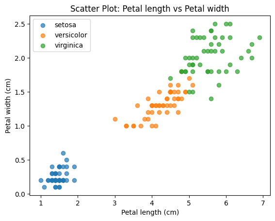
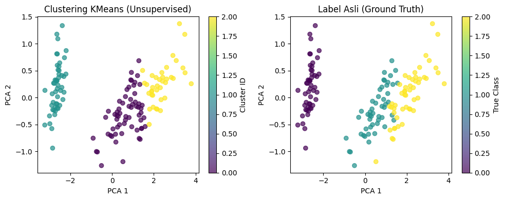

# Supervised vs Unsupervised Learning — Practice Notebook

A hands-on, step-by-step notebook covering both core branches of Machine Learning on the classic **Iris** dataset — Supervised Learning (classification) and Unsupervised Learning (clustering) — plus a set of follow-up experiments to test common assumptions (model complexity, cluster count, feature scaling) against real, verified numbers.

Every result documented below is copied directly from the notebook's actual execution output — nothing here is estimated.

## What's Inside

**Supervised Learning**
- Train/test split with stratification
- Classification with `LogisticRegression`
- Evaluation: accuracy, classification report (precision/recall/F1), 5-fold cross-validation

**Unsupervised Learning**
- Clustering with `KMeans` (no labels used during training)
- Evaluation with **Adjusted Rand Index (ARI)** against the true labels
- 2D visualization via **PCA**, comparing cluster assignments vs ground truth

**Independent Exploration (Section 8)**
- `RandomForestClassifier` vs `LogisticRegression` comparison
- Effect of `n_clusters` (2–6) on ARI
- Effect of `StandardScaler` on clustering quality
- A second dataset (`load_wine`) to test whether scaling effects generalize

## Results & Documentation

### 1. Exploratory Data Analysis

150 samples, 4 features, 3 balanced classes (50 samples each). Plotting just two of the four features already shows why this dataset classifies so well — setosa is linearly separable from the other two species, which only overlap slightly:



### 2. Supervised Learning — Logistic Regression

Train/test split: 120 train / 30 test (`test_size=0.2`, `stratify=y`).

```
Akurasi di data test: 0.9667

Classification report:
              precision    recall  f1-score   support

      setosa       1.00      1.00      1.00        10
  versicolor       1.00      0.90      0.95        10
   virginica       0.91      1.00      0.95        10

    accuracy                           0.97        30
   macro avg       0.97      0.97      0.97        30
weighted avg       0.97      0.97      0.97        30

Cross-validation scores (5-fold): [0.9667 1.     0.9333 0.9667 1.    ]
Rata-rata CV accuracy   : 0.9733
```

Only 1 of 30 test samples was misclassified (a versicolor predicted as virginica). The 5-fold cross-validation confirms this isn't a lucky split — accuracy stays consistently high (93.3%–100%) across folds.

### 3. Unsupervised Learning — KMeans Clustering

KMeans is trained on `X` only — the true species labels (`y`) are never shown to it during clustering.

```
Cluster label unik: [0 1 2]
Adjusted Rand Index (ARI): 0.7302
Semakin dekat ke 1.0, semakin mirip dengan label asli.
```

Reducing the 4 features to 2D with PCA for visualization, the cluster assignments (left) closely mirror the true species labels (right) — visual confirmation of the 0.73 ARI score:



One cluster (setosa) separates perfectly in both plots; the other two clusters show the same slight overlap that also caused the one misclassification in the supervised model above.

### 4. Independent Exploration — Verified Results

| Experiment | Result |
|---|---|
| Random Forest — test accuracy | 90.00% *(vs. 96.67% for Logistic Regression — more complexity ≠ better here)* |
| KMeans ARI by `n_clusters` | k=2: 0.5399 · **k=3: 0.7302** · k=4: 0.6498 · k=5: 0.6125 · k=6: 0.4475 |
| KMeans ARI, Iris — without vs with `StandardScaler` | 0.7302 → 0.6201 *(decreased)* |
| KMeans ARI, Wine — without vs with `StandardScaler` | 0.3711 → 0.8975 *(sharp increase)* |
| Logistic Regression — Wine dataset accuracy | 94.44% *(triggers a `ConvergenceWarning` without scaling)* |

**Key takeaway:** neither "a more complex model" nor "always scale your features" is a universal rule. Random Forest underperformed Logistic Regression on this test set, and scaling helped dramatically on Wine (features span very different natural scales, e.g. `proline` in the hundreds vs. others under 10) but slightly hurt on Iris (features are already on a similar cm scale). Every number in this table was checked by running the code, not assumed from theory.

## Setup

```bash
pip install -r requirements.txt
jupyter notebook tutorial_supervised_unsupervised_learning.ipynb
```

Run cells top to bottom. No external datasets or downloads required — both Iris and Wine are built into `scikit-learn`.

## Environment

Verified against:
- Python 3.12
- scikit-learn 1.8.0
- numpy 2.4.4
- matplotlib 3.10.8

(Notebook is written against a broader compatible range — see `requirements.txt`.)

## Credits

Base tutorial material from the **rubythalib.ai AI Engineer Bootcamp**, mentor **Daniel Syahputra**. This version has been re-executed, cleaned up (removed empty/debug cells, consolidated evaluation steps), and extended with the independent exploration in Section 8.

## Author

**Muhammad Ariel Shakaramiro**
- GitHub: [@arielshakaramiro](https://github.com/arielshakaramiro)
- Blog: [shaka-ai.hashnode.dev](https://shaka-ai.hashnode.dev)
